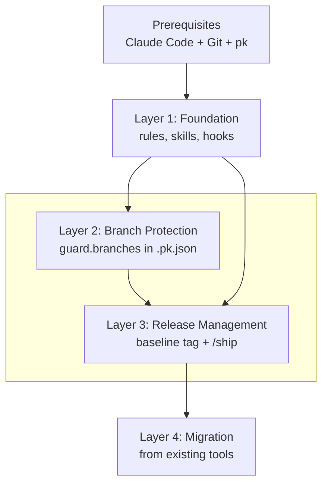

# Adoption

plankit is adopted in layers. Layer 1 is the foundation; Layers 2 and 3 are independent capabilities you add when your project needs them.



## Prerequisites

- **[Claude Code](https://code.claude.com) provides the full experience.** Hooks, rules, skills, and `/ship` all run inside Claude Code. The release CLI (`pk changelog`, `pk release`) also works standalone from any terminal.
- **Git is required.** `pk setup` refuses to install outside a git working tree by default. Pass `--allow-non-git` for the narrow case where only rules and skills are needed before `git init`.
- **pk is required for hook features.** Install via `go install github.com/markwharton/plankit/cmd/pk@latest` or download a binary from the [releases page](https://github.com/markwharton/plankit/releases). See [When pk is not installed](#when-pk-is-not-installed) for what happens without it.

## Layer 1: Foundation

One command installs the full foundation:

```bash
cd your-project
pk setup
# restart Claude Code
```

**What you get:**

- **CLAUDE.md** with critical rules that prevent the most common issues
- **`.claude/rules/`** with detailed guidelines: model behavior, development standards, git discipline
- **Three skills:** `/conventions` (project conventions), `/preserve` (plan preservation), `/ship` (release workflow)
- **Hooks:** branch guard, plan protection, plan preservation

**No configuration needed.** No `.pk.json`, no tags, no additional setup. Guard is installed but is a no-op without branches to protect. Preserve works in manual mode by default; pass `--preserve auto` to `pk setup` to preserve plans automatically on exit from plan mode. Pass `--guard off` or `--preserve off` to disable features you don't need.

**Safe for existing projects.** `pk setup` never overwrites files it didn't create. Files without pk's SHA marker are skipped. Existing hooks in `.claude/settings.json` are preserved. See [Managed file protection](pk-setup.md#managed-file-protection) for details.

**Next step:** Run `/conventions` inside Claude Code to add project-specific conventions to CLAUDE.md. Without project conventions, Claude follows the rules but rediscovers the project each session. With them, it knows the project from the start. See [Customize your CLAUDE.md](pk-setup.md#customize-your-claudemd).

## Layer 2: Branch protection

**When to add:** You have a branch (typically `main`) that should never receive direct commits.

Create `.pk.json` in the project root:

```json
{
  "guard": {
    "branches": ["main"]
  }
}
```

`pk guard` now blocks git mutations on `main` during Claude Code sessions. The default mode is `block`; pass `--guard ask` to `pk setup` to prompt instead. See [pk guard](pk-guard.md) for details. `/conventions` offers to create this configuration for you.

**Server-side complement.** `pk guard` protects the local Claude Code session. A GitHub Ruleset covers the surfaces guard can't reach: pull requests, direct pushes via the GitHub UI, and other collaborators' machines. See [Branch protection](branch-protection.md) for an importable ruleset.

## Layer 3: Release management

**When to add:** You want automated changelogs and a structured release workflow.

This layer builds on three conventions:

- [Conventional Commits](https://www.conventionalcommits.org/) for commit message structure
- [Keep a Changelog](https://keepachangelog.com/) for CHANGELOG.md format
- [Semantic Versioning](https://semver.org/) for version numbering

**Tags are the version source of truth.** plankit reads the version from git tags, not from a version field in package.json, Makefile, or any other project file. This is universal across project types: Go, Node, Python, monorepos where all packages share a version. One source, no files to keep in sync.

**Anchor a baseline tag.** `pk changelog` reads commits since the most recent semver tag. Without one, it has nothing to diff from. Run `pk setup --baseline` to create a `v0.0.0` tag. See [Baseline tag for pk changelog](pk-setup.md#baseline-tag-for-pk-changelog) for the three common scenarios.

**Add release configuration to `.pk.json`:**

```json
{
  "guard": {
    "branches": ["main"]
  },
  "release": {
    "branch": "main"
  }
}
```

`release.branch` is the key config. `changelog.types` has sensible defaults (feat, fix, refactor, etc.) and only needs to be added if your project requires custom type-to-section mapping. See [pk changelog](pk-changelog.md#configuration) for the full reference. `/conventions` offers to create this configuration for you.

**`/ship` is the recommended release workflow.** It chains `pk changelog` and `pk release` with preview and confirm at each step, and handles the clean working tree requirement within the Claude session. Power users can run `pk changelog` and `pk release` directly in the terminal. See [pk release](pk-release.md#workflows) for merge flow vs. trunk flow.

**GitHub CLI is optional but useful.** pk commands use git directly, not `gh`. But `gh` helps with the workflow around releases: monitoring CI runs, creating PRs, checking workflow status. See [Resources](resources.md#github-cli) for common commands.

## Layer 4: Migration

**When:** Switching from commit-and-tag-version, standard-version, semantic-release, or similar tools.

**Existing CHANGELOG.md — leave it as is.** `pk changelog` writes [Keep a Changelog](https://keepachangelog.com/) format and appends new entries *above* your existing content, which stays untouched: new releases in plankit's format, old entries unchanged. This is the simplest, lossless path. Rewriting older entries into plankit's format is optional and **lossy** — anything plankit omits by design (e.g. per-commit SHA links) is dropped — so only do it if you want a uniform file.

**Baseline tag placement.** Where you anchor `v0.0.0` determines what appears in your first pk-generated changelog entry. Use `--at` to include prior history or omit it to start fresh. See [Baseline tag for pk changelog](pk-setup.md#baseline-tag-for-pk-changelog) for the three scenarios.

**Commit type mapping.** The default types cover the standard Conventional Commits set. Add `changelog.types` to `.pk.json` only if your project uses custom types or needs different section names. See [pk changelog](pk-changelog.md#configuration).

**Version propagation.** plankit reads the version from git tags, so many projects need nothing here. Configure it only when a file other than the tag carries the version:

- **JSON manifests/lockfiles** (`package.json`, nested/workspace `package.json`, `package-lock.json`) → list them in `changelog.versionFiles` (JSON only).
- **Non-JSON version strings** (`pyproject.toml`, Python `__version__`, a Go `const version`, a shell script) → bump with `pk pin --file <path> [--name <ident>] $VERSION` chained in `changelog.hooks.preCommit`; `versionFiles` can't touch non-JSON. See [pk pin](pk-pin.md).
- **Files derived from the bump** (lockfiles, generated docs, monorepo cross-refs) → regenerate them in `preCommit`. pk auto-stages `CHANGELOG.md`, every `versionFiles` entry, and any already-tracked file a hook modifies (`git add -u`); add an explicit `git add` in the hook only for newly created/untracked output (e.g. generated docs).
- **`release.hooks.preRelease`** → an optional validation gate run before publishing, e.g. `npm ci && npm run lint && npm test && npm run build`.

Both `postVersion` and `preCommit` hooks receive `$VERSION`. See [pk changelog](pk-changelog.md#configuration) for the full schema.

**NPM projects.** Replace existing release scripts in `package.json`:

```json
{
  "scripts": {
    "release": "pk changelog && pk release",
    "release:dry": "pk changelog --dry-run"
  }
}
```

**Remove the old tool.** Disable or uninstall the previous release tool from CI and dev dependencies before switching, to avoid conflicting tag or changelog writes.

### Migration checklist

Everything that can connect into a plankit release — most projects wire up only a few:

- [ ] **Baseline tag** — a semver `v*` tag for `pk changelog` to diff from (`pk setup --baseline`, `--at <ref>` to fold prior history).
- [ ] **`guard.branches` / `release.branch`** — protected branch and release target in `.pk.json`.
- [ ] **`CHANGELOG.md`** — leave as-is (pk appends above it) or, if you want uniformity, reconcile older entries to Keep a Changelog (lossy).
- [ ] **`changelog.types`** — only for custom commit-type → section mapping; defaults cover the standard set.
- [ ] **`changelog.showScope`** — include the commit scope in changelog entries.
- [ ] **`changelog.versionFiles`** — JSON files (manifests, lockfiles) whose version string pk should bump.
- [ ] **`changelog.hooks.postVersion`** — runs after the bump, before the changelog is written; receives `$VERSION`.
- [ ] **`changelog.hooks.preCommit`** — regenerate/pin files derived from the bump just before the release commit; receives `$VERSION`.
- [ ] **`pk pin`** — bump version strings in non-JSON files (`pyproject.toml`, a Go `const`, Python `__version__`, a shell script like `install-pk.sh`) from inside `preCommit`.
- [ ] **`release.hooks.preRelease`** — validation gate (lint/test/build) run before publishing.
- [ ] **`$VERSION`** — the new version, available as an env var to the `postVersion`, `preCommit`, and `preRelease` hooks.
- [ ] **Remove the old tool** — disable commit-and-tag-version / standard-version / semantic-release in devDependencies and CI.

### A prompt you can hand to Claude

Migration is judgment-heavy — it depends on your build, your dependency graph, and your existing changelog — so it suits an experienced developer working with Claude interactively rather than a fixed command. Paste this prompt into Claude Code (inside the repo, after `pk setup`):

```text
Migrate this established repo onto plankit (pk). `pk setup` has already run. Work through these steps; confirm with me before any write, and stay advisory on anything that tags or pushes.

1. Baseline tag — run `git tag --list 'v*' --sort=-v:refname`. If there's no semver tag, `pk changelog` has nothing to diff from. Offer `pk setup --baseline --at <ref>` (fold prior history into the first entry) or `pk setup --baseline` (start fresh from HEAD); recommend one and let me run it.

2. CHANGELOG.md — default to leaving it untouched (pk appends new entries above old ones, lossless). Offer a rewrite into plankit's format only if I ask, and warn it drops anything pk omits by design (e.g. per-commit SHA links).

3. Version propagation (needs my knowledge of the build) — first decide if it's even needed: if only the git tag carries the version, configure nothing. Otherwise, per version-bearing file: JSON manifests/lockfiles → `changelog.versionFiles`; non-JSON (pyproject.toml, Python `__version__`, Go `const version`, a shell script) → `pk pin --file <f> [--name <id>] $VERSION` in `changelog.hooks.preCommit` (versionFiles is JSON-only); files derived from the bump (lockfiles, generated docs, workspace refs) → regenerate in `preCommit`. pk auto-stages CHANGELOG.md, every versionFiles entry, and already-tracked files a hook changes (`git add -u`) — add an explicit `git add` only for newly created files. Optionally add a `release.hooks.preRelease` gate (e.g. `npm ci && npm run lint && npm test && npm run build`). Show me the merged `.pk.json` (preserve existing keys, sort top-level) before writing.

4. Remove the old tool — find commit-and-tag-version / standard-version / semantic-release in devDependencies and CI and tell me where to disable them so they don't fight pk over tags or the changelog.
```

## When pk is not installed

When a developer clones a pk-configured repo without pk installed, hooks degrade gracefully:

| Feature | Without pk |
|---------|------------|
| CLAUDE.md | Works, Claude Code reads it regardless |
| `.claude/rules/` | Works, loaded automatically |
| `/conventions`, `/preserve`, `/ship` skills | Skills load but pk commands inside them fail |
| `pk guard` hook | Silent no-op, hook exits 127 (non-blocking) |
| `pk preserve` hook | Silent no-op, plans not preserved |
| `pk protect` hook | Silent no-op, plan edits not blocked |

**Cloud sandboxes are handled automatically.** The SessionStart hook runs `.claude/install-pk.sh`, which downloads the pinned pk version at session start. No action needed.

**Local machines get a session-start warning.** When pk is not on PATH, the SessionStart hook prints a warning with install instructions to stderr. Rules and skills still guide Claude, but the protective net (guard, preserve, protect) won't run until pk is installed.
