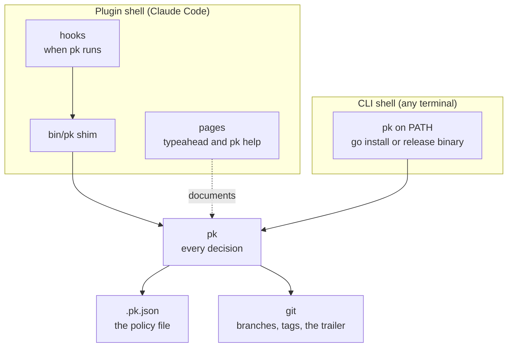

# How plankit works

plankit is a Claude Code plugin. pk is the command it installs. Install
the plugin once per machine and run `pk init` once per repository.
From then on, three things happen in that repository: approved plans
are kept as a record, protected branches refuse commits from the
agent, and releases are computed from commit messages.

## The pieces

The plugin has three parts: hooks that tell Claude Code when to run
pk, pages that document each command, and a shim that finds the pk
binary for the platform. pk holds every decision. The plugin adds
wiring and words, not logic. Remove the plugin and pk still does
everything from a terminal; remove pk and the plugin does nothing.

A repository that uses plankit carries one file of its own: the
policy file, `.pk.json`, committed with the code. The record,
`docs/plans/`, appears when the first plan is preserved. Nothing else
is copied in.

## Plans

Claude plans the work in Plan Mode. When the developer approves the
plan, the preserve hook copies it, byte for byte, into `docs/plans/`
under a dated, sequenced filename. In auto mode preserve commits it at
once. In manual mode, the default, preserve records which plan was
approved and tells the session; `/plankit:preserve` commits it later.

The protect hook denies every edit under `docs/plans/`. A plan is
never changed after approval. When the approach changes, a new plan
is approved and preserved, and the sequence of files is the history
of decisions, reversals included.

## Branches

The guard hook runs before every shell command the agent issues. It
reads the policy file and answers with a decision. Three policies
apply. On a protected branch, a git mutation (`commit`, `merge`,
`push`, `rebase`, `reset`) is denied or questioned. A `git push` on
any branch is denied or questioned. A commit whose message carries a
breaking marker (`!` after the type, or a `BREAKING CHANGE:` footer)
is questioned. When policies overlap, deny beats ask.

The breaking marker drives the next major version. It is the
developer's claim to make, so the agent is asked before it writes
one. `--bump` on the release commands is the same claim and the same
rule.

The brief hook runs as a session starts, resumes, or compacts. It
tells the session the policy in words: the commit types, the
breaking-marker rule, the protected branches, how plans are kept. The
words are rendered from the policy file each time, so they cannot
disagree with what guard, protect, and preserve then enforce.
`pk brief` at a terminal prints the same text.

## Releases

Commits follow Conventional Commits: `feat:`, `fix:`, `docs:`, and
the rest of the table in the policy file. That is the whole input to
a release.

`pk changelog` reads the commits since the last tag and infers the
version: a breaking marker is major, `feat` is minor, anything else
is patch. It writes the section into CHANGELOG.md, stamps the version
into the files the policy names, and commits with a `Release-Tag`
trailer. No tag exists yet; the commit is there to review, and
`pk changelog --undo` unwinds it while it is unpushed.

`pk release` reads the trailer. It checks the tree is clean, the
branch is on origin, and nothing has diverged. It fast-forwards the
release branch, runs the pre-release hook, tags, runs the pre-push
hook, and pushes the branch and the tag together. A failure after the
tag exists rolls back: the tag is deleted, the merge is reset, and the
working branch is checked out again.

`pk ship` runs changelog then release. Its only state is the trailer,
so a ship interrupted between the halves resumes at release on rerun.
Every release command accepts `--dry-run`.

The pushed tag hands off to CI. CI builds the platform binaries,
assembles the plugin archive, and publishes a GitHub release carrying
the archive, the binaries, and the marketplace file that names the
archive's version and digest. Installers see a new version when the
version inside the plugin changes. The release commits nothing back
to a source branch, so the working branch and the release branch are
equal when it finishes.

## Pages

Every command has one page, written once. Claude Code loads it as a
`/plankit:` shortcut, `pk help` prints it in a terminal, and
plankit.com renders it as HTML. The pages are compiled at build time
and checked for drift. A page carrying hidden or direction-changing
characters fails the build, because pages load into other people's
sessions.

## Two promises

A hook never blocks work by failing. Whatever goes wrong inside it,
including a policy file that no longer loads, it reports the problem,
Claude Code shows the message, and the command continues.

A repository without a policy file gets no action from any hook. The
plugin is installed everywhere; it is on only where `pk init` ran.

## Outside Claude Code

The hooks are the only Claude Code-specific part. Guard, changelog,
release, ship, and pin work in any terminal. pk installs on its own
with `go install`, or as a release binary without Go, on macOS, Linux,
and Windows. A team member who never opens Claude Code gets the same
protected branches and the same releases from the same policy file.
The method behind this page is in
[docs/design.md](https://github.com/markwharton/plankit/blob/main/docs/design.md).
