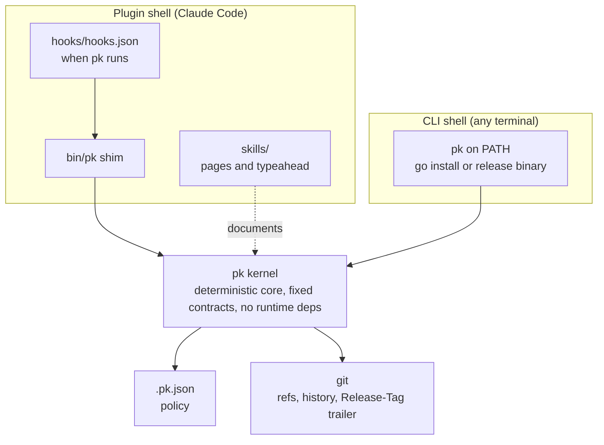

# Architecture

plankit is a Claude Code plugin with a Go kernel. pk is the binary
the plugin ships and the command you run, inside Claude Code and in
any terminal. This document maps the components; the method behind
their shape is docs/design.md.

pk is a kernel in a specific sense: a deterministic core with a fixed
contract surface (the exit taxonomy, the stream discipline, the hook
guarantees, deny-over-ask), no runtime dependencies, and every
behavior derived from typed state it re-reads on each invocation.
Around it sit two thin shells, the Claude Code plugin and the bare
CLI, which add wiring and documentation but no logic. The asymmetry
is the test: remove the shells and pk still does everything from a
terminal; remove pk and the shells are empty.

The repository is the plugin and its own marketplace. The split rule
that shaped the rewrite: anything that must be deterministic (git operations, config,
hook decisions, changelog and release mechanics) lives in the binary;
anything that is judgment or orchestration lives in skills.

## One source, two consumers

`skills/` is the documentation. Each command has a topic directory
(`skills/status/SKILL.md`) plus the `plankit` overview; the frontmatter
is `name`, `description`, and optionally `argument-hint`. The same
files serve three consumers:

- Claude Code discovers them as `/plankit:` shortcuts when the plugin
  is enabled.
- `tools/docgen` compiles them at build time into `internal/help/data`
  (a strict JSON IR per topic plus the raw bytes), and `pk help`
  renders that in the terminal.
- `make site` renders them, with the README, the design documents,
  and the changelog, into plankit.com through `site/layout.html`;
  `site.yml` deploys the result and mirrors the published
  marketplace.json from the latest release.

docgen is a separate Go module so goldmark never links into pk; the
main module is standard library only. docgen also validates: required
frontmatter, name matching the directory, a single opening H1,
unknown keys refused. `cmd/pk/main_test.go` enforces the 1:1 rule
mechanically — every command has a skill, every skill (minus the
overview) is a command, and `hooks/hooks.json` references only
registered commands through the quoted shim form.

At runtime, a TTY gets the IR rendered with a conservative ANSI
palette and width-clamped wrapping; a non-TTY consumer gets the exact
authored bytes. Presentation is never configured: flags (`--format`,
`--plain`) beat env (`NO_COLOR`, `CLICOLOR_FORCE`) beat the TTY probe.

## The execution frame

`cmd/pk/main.go` holds the explicit command registry. `internal/cli`
supplies the frame: declarative `FlagSpec`s, universal flags
(`--project-dir`, `--format`, `--plain`, `--quiet`), and a `Context`
carrying resolved project dir and IO. The `--help` and usage-error
output derives from those same structs, so registering a flag and
documenting it are one declaration, and positionals beyond a
command's declared `MaxArgs` are refused before `Run` is reached. The default project dir walks up
to the git root; explicit paths are taken as given.

Two contracts hold everywhere:

- **Exit taxonomy**: 0 success, 1 usage, 2 state or precondition,
  3 internal. Errors name the fix (`cli.Usagef`, `cli.Statef`,
  `cli.WithHint`).
- **Stream discipline**: artifacts on stdout (dry-run sections, JSON
  state), narration on stderr. Commit and release paths keep stdout
  empty.

## Repo model

`.pk.json` at the repository root is the committed policy, decoded
strictly: unknown keys are named and refused. `pk init` writes the
canonical default (guard on the release branch, the full changelog
type table, a v0.0.0 baseline tag when history exists untagged) and
`pk status` reports configuration and state, `--format json` included.
A configured repository carries exactly two things: `.pk.json` and
`docs/plans/`. No `.pk.json` means off.

`internal/git` wraps the git CLI (`Exec` with stderr folded into
errors) plus the helpers the flows share: `FindRoot` (filesystem walk,
no subprocess), `CheckCleanTree`, `DefaultBranch` (origin HEAD
symref), `LatestTag`, `ParseRepoURL`.

## Hooks

`hooks/hooks.json` wires three hooks through
`"${CLAUDE_PLUGIN_ROOT}"/bin/pk`:

- **guard** (PreToolUse, Bash|PowerShell): parses the shell command
  quote-aware, finds git mutations, and denies or asks per
  `guard.branches` and the push policy. Handles backslash paths and
  `.exe` suffixes so the PowerShell fallback is covered.
- **protect** (PreToolUse, Edit and Write): denies writes under
  `docs/plans/`, resolving symlinks through the nearest existing
  ancestor so both sides of the comparison are canonical.
- **preserve** (PostToolUse, ExitPlanMode): captures the approved plan
  into `docs/plans/` as a dated, slugged, deduplicated file and
  commits it (auto mode), or records a pointer and notifies (manual).

`internal/hookio` owns the protocol: payload parsing, project-dir
resolution (`CLAUDE_PROJECT_DIR`, then payload cwd, then context), and
the PreToolUse permission-decision and PostToolUse response writers.
Two behavioral contracts: every hook exits 0 whatever happens (a
broken hook must never block work), and an unconfigured repository is
a fast silent no-op.

## Release machinery

Releases are a trailer-driven two-step. `pk changelog` parses the
conventional commits since the last tag, infers the bump (breaking →
major, feat → minor, else patch), writes the section into
CHANGELOG.md, stamps any `changelog.versionFiles` (a streaming JSON
splice that preserves formatting; this repo stamps
`.claude-plugin/plugin.json`), runs the `postVersion` and `preCommit`
hooks, and commits with a `Release-Tag` trailer. No tag yet: the
commit is reviewable and `--undo` unwinds it while unpushed.

`pk release` reads the trailer, runs the pre-flight ladder (clean
tree, branch on origin and not behind, release branch resolvable and
not diverged), then either fast-forwards the release branch and tags
(merge flow, `release.branch` set) or tags the default branch (trunk
flow, `release.branch` empty), runs `preRelease` before the tag and
`prePush` after it, and pushes atomically. Everything mutating sits
under a rollback defer: an aborted release deletes the unpushed tag,
resets the merge, and returns to the source branch.

`pk pin` updates version pins in files from hooks; a missing file is a
no-op and a pinless file a warning, so a renamed target never aborts a
release. `pk ship` composes the two-step into one invocation for
unattended releases, deriving what remains from the trailer: pending
means resume at release, absent means run both.

## Supply chain

`bin/` holds two committed shims: `bin/pk` (POSIX sh, uname dispatch,
MINGW-aware) and `bin/pk.cmd` (cmd, PROCESSOR_ARCHITECTURE dispatch,
CRLF pinned by `.gitattributes`). The per-platform binaries beside
them (`pk-<os>-<arch>`) are gitignored release assets; `make bin-local`
builds the current platform for `--plugin-dir` development and
`make dist` cross-compiles all targets.

`pk release` pushing the tag triggers `.github/workflows/release.yml`:
cross-compile, assemble the plugin archive (`.claude-plugin/
plugin.json`, `skills/`, `hooks/`, `bin/` with binaries, LICENSE,
CHANGELOG.md, README.md at zip root), and publish the GitHub release
with the archive, the binaries, and the published `marketplace.json`,
whose archive source carries the versioned URL and sha256. That pin is
a derived value, so it lives on the release as an asset and is
mirrored by the site; it is never committed to a source branch, which
keeps develop and main equal after every release. The explicit
version inside plugin.json wins version resolution, so installers
update exactly when a release is cut. The in-repo
`.claude-plugin/marketplace.json` is the development manifest for
`--plugin-dir` and validation, and the template the published one is
derived from. `ci.yml` runs the suite, gofmt
and docgen drift checks, and `claude plugin validate . --strict`.

The `binaries` map observed in the Claude Code validator (basename →
sha256, install-time fetch) would let installs pull one platform's
binary instead of the whole set; its fetch semantics are not yet
published, so the archive stays the channel until they are.

## Testing

Tests drive commands through `cli.RunIO` with buffers and real
repositories in `t.TempDir()`. Push flows use a bare origin;
divergence and behind-origin states come from a second clone, and the
release rollback is proven by a `pre-receive` hook in the bare origin
that rejects the push. Date-sensitive output pins a package-level
`now`. No mocking libraries, no third-party test dependencies.

## What moved out of Go

v1's setup, teardown, update, rules, scaffold, and readiness packages
dissolved: the plugin install replaced per-repository file copying,
skills replaced the docs corpus and shipped workflow scripts, and the
update notice machinery is unnecessary when the marketplace carries
versioning. Their durable behaviors (baseline tagging, pinning, the
hook wiring) live on in `pk init`, `pk pin`, and `hooks/hooks.json`.
