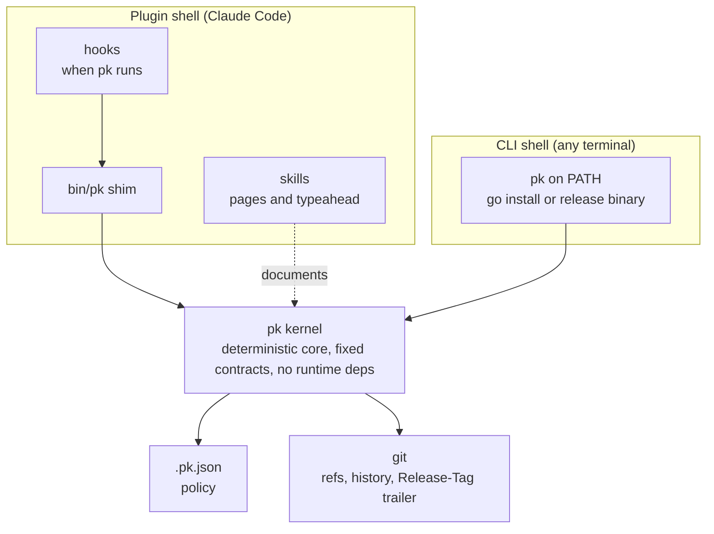

# How plankit works

plankit is the plugin; pk is the command it installs. Install the
plugin once per machine, run `pk init` once per repository, and three
things start happening: approved plans are kept as records, protected
branches refuse careless commits, and releases derive themselves from
your commit messages. This page explains the shape behind that; the
method behind the shape is in
[docs/design.md](https://github.com/markwharton/plankit/blob/main/docs/design.md).

## The shape

pk is a kernel in a specific sense: a deterministic core with a fixed
contract surface, no runtime dependencies, and every behavior derived
from state it re-reads on each invocation. Around it sit two thin
shells, the Claude Code plugin and the bare command line, which add
wiring and documentation but no logic. The asymmetry is the test:
remove the shells and pk still does everything from a terminal;
remove pk and the shells are empty.

## What runs when

The plugin wires four hooks into Claude Code, and each one is a call
to pk with the event on standard input:

- **brief** runs as a session starts, resumes, or compacts, and tells
  it this repository's policy: the commit types, the breaking-marker
  rule, the protected branches, how plans are kept. The text is
  rendered from `.pk.json` each time, so it cannot disagree with what
  the other hooks then enforce, and `pk brief` at a terminal shows you
  exactly what sessions receive.
- **guard** runs before every shell command. It reads the command,
  finds git mutations, and denies or asks according to your policy:
  commits and pushes on a protected branch, any push at all, and any
  commit whose message carries a breaking-change marker (`!` or
  `BREAKING CHANGE`). That last one is the rule that markers are the
  developer's claim to make, not the agent's.
- **protect** runs before every file edit and denies writes under
  `docs/plans/`, so a preserved plan can never be quietly rewritten to
  match what got built.
- **preserve** runs when a plan is approved and captures it, byte for
  byte, into `docs/plans/` under a dated, sequenced filename. In auto
  mode it commits immediately; in manual mode it records a pointer and
  waits for you to say `/plankit:preserve`.

Two promises hold for all four. A hook never blocks work by
accident: whatever goes wrong inside it, it exits cleanly and Claude
Code continues. And a repository without `.pk.json` is a repository
where nothing happens: the plugin is installed everywhere, but it is
on only where you configured it.

## What a repository carries

Exactly two things: `.pk.json`, the committed policy, and
`docs/plans/`, the record. `pk init` writes both, tags a `v0.0.0`
baseline if the history has none, and prints the commit convention
the release machinery will read. `pk status` reports the policy and
the current state.

The policy is small and stated in full. Guard has three dials, for
protected-branch mutations, for pushes, and for breaking markers.
Preserve has one: auto, manual, or off. The changelog carries the
table of commit types and the sections they land in, the files whose
version field gets stamped at release, and the branch releases merge
to. Plans have no dial: immutability is what makes a plan a record.

## How a release happens

Write commits in Conventional Commits form as you work: `feat:`,
`fix:`, `docs:`, and the rest, with `!` for a breaking change only
when you mean it. That is the whole input. When it is time:

`pk changelog` reads the commits since the last tag, infers the next
version (breaking is major, `feat` is minor, anything else patch),
writes the section into CHANGELOG.md, stamps the version into any
files you named, and commits with a `Release-Tag` trailer. Nothing is
tagged yet; the commit is there to review, and `--undo` unwinds it.

`pk release` reads that trailer, checks the ground (clean tree, branch
on origin, nothing diverged), fast-forwards the release branch, runs
your pre-release hook, tags, runs your pre-push hook, and pushes the
branch and the tag together. If anything fails after the tag exists,
it rolls back: tag deleted, merge reset, back on your branch.

`pk ship` runs both. Its only state is that trailer, so a ship
interrupted between the halves resumes at release when you run it
again. Everything above has `--dry-run`, and a dry run of the
changelog works even on a dirty tree, so previewing is free.

Pushing the tag is the hand-off to CI: the platform binaries are
built, the plugin archive is assembled, and the GitHub release
carries them together with the published marketplace file, whose
archive source names the exact version and its digest. Installers
update when the version inside the plugin changes, which is to say
when you cut a release. Nothing is committed back to a source branch
by the release; develop and main are equal when it finishes.

## One source, three consumers

Every command has one page, written once. Claude Code loads it as a
`/plankit:` shortcut, `pk help` renders it in the terminal, and this
site renders it as HTML. The same file, so the same words. The pages
are compiled at build time, checked for drift, and rejected if they
carry hidden or direction-changing characters, because they load into
other people's model contexts. What you read here is what Claude
reads.

## Outside Claude Code

The hooks are the only Claude Code-specific piece. Guard, changelog,
release, ship, and pin are plain git discipline and work in any
terminal, so pk installs on its own too: `go install` with Go, or a
release binary without it, on macOS, Linux, or Windows. A team member
who never opens Claude Code still gets protected branches and derived
releases from the same `.pk.json`.
