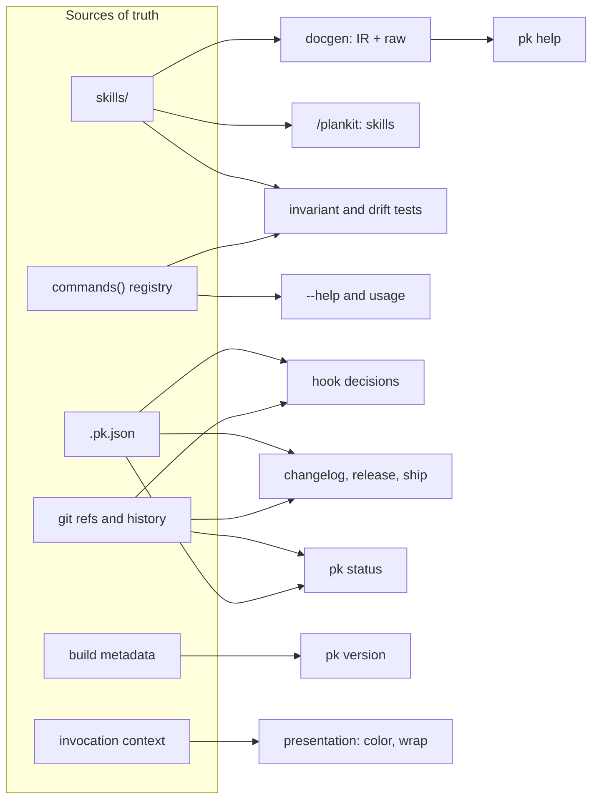

# Design

architecture.md maps the components. This document explains the method
that shaped them, so a change made without the original context still
lands in the right place. The method is one rule applied everywhere:

**State lives in exactly one place, typed; everything else is derived
from it on demand.**

Nothing in pk caches, copies, or mirrors state. Every command, every
hook decision, every document, and every release artifact is computed
fresh from a source of truth at the moment it is needed. When you know
which source owns a fact, you know where a change goes, and everything
downstream follows without being touched.

## The layered build

The rewrite landed in layers, each one becoming known state the next
derives from:

- **0 execution frame**: the contracts every command runs inside
  (flags, context, exit taxonomy, streams).
- **1 help engine**: skills compiled to a typed IR, rendered at
  runtime; the documentation pipeline before there was anything to
  document, because every later layer ships its skill.
- **2 repo model**: `.pk.json` as typed policy, git as state store,
  init and status.
- **3 hook trio**: guard, protect, preserve deriving decisions from
  layers 2's state.
- **4 release machinery**: changelog, release, pin deriving versions
  and artifacts from git history and config.
- **5 plugin shell**: the manifests and shims packaging layers 0-4;
  assembly, not authoring.
- **6 supply chain**: the release deriving the distributable from a
  tag push.

The order is the dependency order. A layer never reaches up, so each
one was testable complete before the next began, and the same holds
for maintenance: a change in layer N cannot break the layers below it.

## The sources of truth

Six sources own everything; each has one owner and many readers.

**Git history and refs.** Branches, tags, commit messages, the working
tree, and the Release-Tag trailer. pk keeps no database: the pending
release lives as a trailer on HEAD, the pending plan as a pointer file
under `.git/`, the last version as the highest semver tag. Every
command re-reads git at invocation, so pk can never disagree with the
repository.

The names these mechanisms travel under — the `Release-Tag` trailer
key, the `plan` commit type, the pending-plan pointer filename — are
protocol vocabulary: each is a single Go constant, the machinery's
own language rather than policy or documentation. Config may govern a
protocol name's presentation (`.pk.json` hides the `plan` type from
changelogs by default) but never its spelling; the docs may narrate
it, pinned by drift tests where they do.

**`.pk.json`.** All policy: guard modes and branches, the breaking
dial, preserve mode, the changelog type table, version files, hooks,
the release branch. Decoded strictly into `PkConfig` at every
invocation; behavior is derived from the struct, never remembered
between runs. Absence of the file is itself state: plankit is off.

**`skills/`.** All narrative documentation. docgen derives the typed
IR and the committed raw copies; the plugin ships the same files;
`pk help` renders them. One authored source, two consumers, drift
impossible. The flag reference is the other documentation view,
derived from the registry: `--help` and usage errors print the
Summary and every flag from the `Command` struct, so the reference
cannot disagree with the code, and it cross-links to the narrative.
The two one-liners are deliberately independent: `Summary` is the CLI
index line, the skill's `description` is the typeahead line, and for
hook commands they rightly differ in kind. Where both views could
state a fact, the reference owns flags and the narrative owns
concepts.

**`commands()` in `cmd/pk/main.go`.** The command registry. The
`--help` and usage reference derives from it — a flag's registration
and its documentation are one declaration, so the reference cannot
desync from parsing — and two invariant tests derive the rest:
every command has its skill and every hook wire references a
registered command (`TestCommandsAndSkillsAreOneToOne`,
`TestHookWiringMatchesRegisteredCommands`).

**Build metadata.** The version resolves from one ordered derivation:
ldflags stamp, then the module version for go-install builds, then
VCS revision for source checkouts, then `dev`.

**Invocation context.** Presentation derives from flags, then
environment (`NO_COLOR`, `CLICOLOR_FORCE`), then the TTY probe. It is
never configured, because it is a property of this invocation, not of
the repository.

The same picture as a graph: each source has one owner on the left
and its readers on the right; no artifact on the right is ever edited
by hand.



## The release as one derivation chain

The clearest expression of the rule is the release. Conventional
commit messages are the input state, and everything downstream is
computed:

commit messages → parsed `Commit` values → section grouping and bump
inference → next version → CHANGELOG.md section → version stamped into
`.claude-plugin/plugin.json` (a splice into the file's own bytes) →
Release-Tag trailer on the release commit → `pk release` reads the
trailer and derives the tag → the tag push derives the archive, the
digest, and the marketplace pin.

No step invents state; each reads the committed artifact of the step
before. The trailer is the handoff between changelog and release, and
because it lives in git, either side can be run, inspected, or undone
independently. The one place human judgment enters the chain — the
breaking marker — is gated where it is written (guard asks), so the
derivation downstream never needs a correction mechanism.

## Documents are types

Every document pk reads or writes has a Go struct that is its schema.
The struct declares what the file can say; the decoder enforces it.
The guard section of `.pk.json`, for example, is exactly this:

```go internal/config/config.go
type GuardConfig struct {
	Branches []string `json:"branches,omitempty"`
	Mode     string   `json:"mode,omitempty"` // block | ask | off
	Push     string   `json:"push,omitempty"` // block | ask | off
	// Breaking governs commits whose message carries a breaking-change
	// marker (! or a BREAKING CHANGE footer). Markers are user-approved
	// claims, not agent judgment, so guard asks before one is written.
	Breaking string `json:"breaking,omitempty"` // ask | off
}
```

(Code blocks in this document that name a source file are checked
against it by the test suite, so they cannot drift from the code.)

- **Strict decode at the boundary.** `.pk.json` and the help IR both
  decode with unknown fields refused, so a typo fails loudly at load
  instead of silently changing behavior.
- **Validate once, thread the struct.** `Validate()` names the exact
  bad key (`guard.breaking: "aks" is not one of [ask off]`); past
  that point the program trusts the types.
- **Absent means default, resolved by method.** Optional fields are
  empty in the struct and resolved through `Resolved*()` accessors
  (`ResolvedMode`, `ResolvedPush`, `ResolvedBreaking`), so the default
  lives in one function, not scattered at call sites, and a config
  that omits a key keeps meaning something.
- **Round-trip canonical writes for pk-owned files.** `Default()`
  produces the full canonical config, `Write` serializes it, `Load`
  reads it back identically. What `pk init` writes is exactly what the
  schema says.
- **Splice, don't rewrite, for user-owned files.** When pk edits a
  file it does not own (a version field in someone's JSON, a pin in a
  script), it locates the value and replaces only those bytes,
  preserving the owner's formatting. `spliceJSONVersion` and the pin
  matchers are this pattern.
- **Typed intermediates for external formats.** git log output becomes
  `Commit` values, hook payloads become `hookio.Input`, versions
  become `Semver` with round-trip validation (`parsed.String()` must
  equal the input). Decisions are made on types, never on strings.

The whole of what changelog knows about a commit is one such
intermediate:

```go internal/changelog/changelog.go
type Commit struct {
	Hash     string
	Type     string
	Scope    string
	Message  string
	Breaking bool
}
```

The IR is the pattern applied to documentation: SKILL.md compiles into
`Doc`/`Block`/`Span` structs serialized as JSON, and the runtime
renderer walks the types. The struct is the contract between build
time and runtime; goldmark never enters the binary.

## The contracts

Derivation only stays simple because every component honors the same
frame:

- **Exit taxonomy**: 0 success, 1 usage, 2 state, 3 internal; errors
  name the fix.
- **Streams**: artifacts on stdout, narration on stderr; commit paths
  keep stdout empty.
- **Hooks fail open and gate on config**: exit 0 always, silent no-op
  without `.pk.json`.
- **Precedence is fixed**: deny beats ask; the strongest applicable
  decision wins.
- **Consequence is confirmed at the action**: pushes are the
  developer's, breaking markers are the developer's, and everything
  mutating is rehearsable (`--dry-run`), undoable (`--undo`, the
  release rollback defer), or both.

## Where logic lives

- **Deterministic → the binary.** Parsing, git operations, policy
  decisions, derivations.
- **Judgment → skills.** When to release, what a plan should say, how
  to respond to a guard ask.
- **Policy → `.pk.json`.** What the deterministic code should decide.
- **Wiring → `hooks/hooks.json`.** When the binary runs. Dumb and
  stable: features arrive through config and binary, never through
  wiring, which is why a behavior change reaches every repo as one
  plugin update.

This split is what makes pk a kernel in architecture.md's sense: the
shells hold wiring and words, the binary holds every decision.

## Derivation under test

Tests check derivations against real state, not mocks: scripted
repositories in `t.TempDir()`, bare origins for push flows, a
`pre-receive` hook to prove the rollback, a stubbed `now` for dates.
The invariant tests enforce the source-of-truth relationships
mechanically, and CI closes the loop with drift checks: gofmt, the
committed docgen output, and `claude plugin validate --strict`. If a
derived artifact and its source disagree, the build fails.

## Extending pk

The recipes fall out of the rule.

**A new command**: register it in `commands()`, write
`skills/<name>/SKILL.md`, implement `Run(ctx)` against the frame, test
through `cli.RunIO` with a scripted repo. The invariant test fails
until the skill exists; `make docs` compiles it into help.

**A new policy**: add the field to the config struct, a `Resolved*()`
default, a `Validate()` rule, and the value in `Default()`; derive the
behavior from the field where the decision is made. No wiring changes,
no migration: absent keys mean the default.

**A new document**: define the struct, decode strictly, validate at
load, and choose the write mode by ownership — canonical if pk owns
the file, splice if the user does.

**A composed command**: invoke the existing commands through their
public boundary (`cli.RunIO` with the child's argv), propagate their
already-reported failures with `cli.Silent`, and carry no state of
your own — derive what remains from the sources of truth the halves
already share. `pk ship` is the pattern: the Release-Tag trailer
tells it whether changelog already ran, which is also what makes it
resumable for free.

Follow the recipes and the property that makes this codebase
maintainable holds by construction: every fact has one home, every
behavior is a computation from a home, and reading the source of truth
tells you what the system will do.
