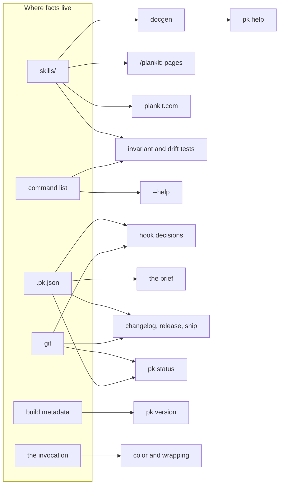

# Design

This is the design for someone changing pk. It answers four
questions: where does a fact live, where does a change go, what must
every command keep true, and how is a change proved. The words are
the ones [How plankit works](architecture.md) uses: the plugin, pk, a
page, the policy file, the record, a session, the four hooks.

## Where a fact lives

Every fact has one home, and pk reads it there every time. Nothing is
cached, copied, or remembered between runs. Change the home and every
reader follows.

- **git** holds branches, tags, commit messages, and the working
  tree. The pending release is the `Release-Tag` trailer on HEAD. The
  pending plan is a pointer file under `.git/`. The last version is
  the highest semver tag. pk has no database.
- **The policy file** holds every dial: guard's branches and its three
  modes, preserve's mode, the commit-type table, the version files to
  stamp, the release hooks, the release branch. Absence of the file
  means plankit is off in that repository. Its JSON Schema, served at
  `plankit.com/pk.schema.json` and named in the file's `$schema` key,
  is generated by docgen from the structs and the settings table, so
  an editor and the loader enforce the same keys and values.
- **The pages** in `skills/` hold all documentation. Nothing about a
  command is written anywhere else. A page's Flags section is not
  written at all: `make docs` generates it from the command's
  `FlagSpec` values between markers docgen owns, so the page, the
  plugin, `pk help`, and plankit.com carry the same lines `--help`
  prints. The overview carries the universal flags the same way, once,
  and the guard, preserve, changelog, and release pages carry a
  Settings section generated from the settings table.
- **The command list** in `cmd/pk/main.go` holds every command with
  its flags. `--help` prints from it, so the flag reference cannot
  disagree with the parser.
- **Build metadata** holds the version: the release stamp, else the
  module version for `go install`, else the commit for a source
  build, else `dev`.
- **The invocation** holds presentation: `--format` and `--plain`,
  then `NO_COLOR` and `CLICOLOR_FORCE`, then whether stdout is a
  terminal. Presentation is never in the policy file.

Three names are pk's own vocabulary and live as single Go constants:
the `Release-Tag` trailer key, the `plan` commit type, and the
pending-plan pointer filename. The policy file can hide the `plan`
type from changelogs; it cannot rename it.



## Where a change goes

- A decision goes in Go. Parsing, git operations, and every hook
  answer are computed, never left to the agent.
- Judgment goes in a page. When to release, what a plan should say,
  how to respond when guard asks.
- Policy goes in the policy file. A new dial is a new field.
- Wiring goes in `hooks/hooks.json`, and only when Claude Code needs
  to call pk at a new event. A new behavior is a binary change plus a
  policy field, never a wiring change. That is why one plugin update
  reaches every repository.

The pages are the one authored input. docgen compiles them at build
time into `internal/help/data`, which is committed so the standard
library-only binary can embed it, and never edited; the directory's
own README says so. The plugin ships the page files. plankit.com
renders them again. The compiled copies cannot drift from the pages.
The pages can go stale against the code, and no derivation fixes an
authored sentence; review and the tests below are the guard for that.

## What every command keeps true

- Exit codes: 0 success, 1 bad invocation, 2 precondition not met, 3
  pk failed. An error names the fix.
- Streams: results on stdout, narration on stderr. A command that
  commits leaves stdout empty.
- A hook exits 0 when it acts or declines, and answers nothing without
  a policy file. A problem it cannot act on, a policy file that fails
  to load or an unreadable payload, is reported on stderr with exit 1,
  which Claude Code shows to the person and then continues. A hook
  never exits 2, which would block the tool call: a hook that blocks
  work by failing is worse than one that lets a command through.
- When guard's policies overlap, deny beats ask.
- A push and a breaking marker are the developer's. Everything that
  mutates can be rehearsed with `--dry-run`, and the release commit
  can be unwound with `--undo`.
- An explicit `--project-dir` or `PK_PROJECT_DIR` beats the payload's
  `cwd`, which beats `CLAUDE_PROJECT_DIR`, which beats the process
  directory. A stated directory wins; where the session is beats
  where it began.
- A command's `Summary` and its page's `description` say what the
  command is for, not which features it has. Nothing derives those
  two lines; a change in behavior means rereading them.

## How files are read and written

Every file pk reads has a Go struct that is its schema. The guard
section of the policy file is this struct:

```go internal/config/config.go
type GuardConfig struct {
	Branches []string `json:"branches,omitempty"`
	// Breaking governs commits whose message carries a breaking-change
	// marker (! or a BREAKING CHANGE footer). Markers are user-approved
	// claims, not agent judgment, so guard asks before one is written.
	Breaking string `json:"breaking,omitempty"` // ask | off
	Mode     string `json:"mode,omitempty"`     // block | ask | off
	Push     string `json:"push,omitempty"`     // block | ask | off
}
```

Unknown keys are refused by name at load. `Validate` names a bad
value (`guard.breaking: "aks" is not one of [ask off]`). An absent key
means its default, resolved through one `Resolved*` method per field,
so the default lives in one place. Files pk owns are written whole
from `Default()`. Files the developer owns, such as a `version` field
in their JSON, are spliced: only the value's bytes change.

Everything external is parsed into a struct before any decision. A
git log line becomes this:

```go internal/changelog/changelog.go
type Commit struct {
	Hash     string
	Type     string
	Scope    string
	Message  string
	Breaking bool
}
```

The code blocks above are checked against their source files by
`TestDesignDocCodeBlocksMatchSource`.

## How a release is computed

Commit messages are parsed into `Commit` values. The values decide the
sections and the bump. The bump and the last tag give the version. The
version is written into CHANGELOG.md and spliced into the files the
policy names, and the commit carries the version as the trailer.
`pk release` reads the trailer, tags, and pushes. The tag push builds
the archive and its digest and publishes them with the marketplace
file as release assets. The digest is computed, so it is never
committed to a source branch. The one place judgment enters is the
breaking marker, and guard asks there.

## Where the code is

- `cmd/pk/main.go`: the entry point.
- `internal/registry`: the command list, read by main to dispatch, by
  the invariant tests, and by docgen for the generated Flags sections.
- `internal/cli`: the frame every command runs in. `Command`,
  `FlagSpec`, `Context`, the exit codes, `MaxArgs`, and the `--help`
  printers.
- `internal/msg`: every `Error:`, `Warning:`, `Note:`, and `Hint:`
  prefix. Nowhere else prints one.
- `internal/help`: the compiled page types, their loader, the terminal
  renderer, and the embedded `data/`.
- `internal/config`: the policy file's structs, `Validate`, `Default`,
  the `Resolved*` methods, the vocabulary constants, and the settings
  table: every key with its allowed values, default, and meaning,
  which `Validate` reads and docgen writes into each page's Settings
  section.
- `internal/git`: the git wrapper: `FindRoot`, `CurrentBranch`,
  `DefaultBranch`, `LatestTag`, `CheckCleanTree`.
- `internal/hookio`: the hook protocol: payload parsing, project
  directory resolution, and the response writers.
- `internal/brief`, `internal/guard`, `internal/protect`,
  `internal/preserve`: the four hooks.
- `internal/changelog`, `internal/release`, `internal/ship`: the
  release commands; `pin.go` in release for version pins.
- `internal/version`: version resolution.
- `tools/docgen`: a separate module and the only third-party
  dependency (goldmark, build time only). Rewrites the generated
  regions from the command list and the settings table, compiles the
  pages; validates the frontmatter, the opening heading, and the
  absence of hidden characters; builds plankit.com with `-site`,
  including the policy file's JSON Schema.
- `skills/`: the pages. A page opening `# pk <name>` documents a
  command; a page opening `# <name>` is a document (`plankit`,
  `craft`).
- `hooks/hooks.json`: the wiring. `grep -c '"type": "command"'
  hooks/hooks.json` prints the wire count.
- `bin/`: the two shims, committed; the platform binaries, built by
  `make dist` for every triple in the Makefile's `TRIPLES`, ignored.
- `.claude-plugin/`: `plugin.json` (version stamped by changelog) and
  the development `marketplace.json` the published one is derived
  from.
- `docs/notes/`: release notes, one `v<version>.md` per minor or major
  release, with `version`, `date`, and `title` frontmatter. plankit.com
  renders the notes whose tag exists.
- `site/`: the layout, stylesheet, and redirects for plankit.com.
- `.github/workflows/`: `ci.yml` (tests, drift checks, strict
  validation, site build), `release.yml` (tag to release assets),
  `site.yml` (build and deploy).

## How a change is proved

Tests run commands against real repositories in `t.TempDir()`, with
bare origins for pushes and a `pre-receive` hook to prove the release
rollback. No mocks. The hook tests send the payloads a session would.

The invariants are tests. Every command page has its command and
every hook wire names a registered command
(`TestCommandsAndSkillsAreOneToOne`,
`TestHookWiringMatchesRegisteredCommands`). The changelog page lists
the default type table (`TestChangelogSkillListsDefaultTypeTable`).
The guard and preserve pages name every dial in their body and their
description (`TestHookSkillsNameEveryDial`). The code blocks in this
file match their sources.

CI adds the drift checks: gofmt, the committed docgen output, and
`claude plugin validate . --strict`. What no test covers, review
does: whether a sentence is still true, and whether a layer imports
one above it.

## Debugging the hooks

A hook is a function of the payload on stdin and the policy file, and
answers on stdout. A pipe reproduces it. Silence means allow. `cwd`
in the payload is how the hook finds the repository.

```bash
# guard: PreToolUse on Bash. A breaking marker gets ask; on a
# protected branch, deny; a plain feat: gets silence.
echo '{"cwd":"'"$PWD"'","tool_input":{"command":"git commit -m \"feat!: drop the session cookie\""}}' | pk guard | jq

# protect: PreToolUse on Edit/Write. A path under docs/plans/ gets deny.
echo '{"cwd":"'"$PWD"'","tool_input":{"file_path":"'"$PWD"'/docs/plans/example.md"}}' | pk protect | jq

# preserve: PostToolUse on ExitPlanMode. tool_response carries the
# approved plan's path under ~/.claude/plans/. With no readable plan of
# at least minPlanSize bytes (grep minPlanSize internal/preserve/preserve.go)
# at that path the hook is silent. --dry-run prints the reason to stderr.
echo '{"cwd":"'"$PWD"'","tool_response":{"filePath":"~/.claude/plans/example.md"}}' | pk preserve --dry-run
# In a scratch repository: a real plan file makes manual mode write a
# pending-plan pointer under .git/ and answer with the message telling
# the session to run /plankit:preserve; auto mode commits it.
mkdir -p ~/.claude/plans && printf '# Example plan\n\nEnough content here to pass the minimum size for a real plan.\n' > ~/.claude/plans/example.md
echo '{"cwd":"'"$PWD"'","tool_response":{"filePath":"~/.claude/plans/example.md"}}' | pk preserve | jq

# brief: SessionStart. The envelope with the policy text; with no
# payload, the same text as prose.
echo '{"cwd":"'"$PWD"'","hook_event_name":"SessionStart","source":"startup"}' | pk brief | jq
pk brief < /dev/null
```

A decision comes back as `hookSpecificOutput` with the event name and,
for PreToolUse, a `permissionDecision` of `deny` or `ask` with its
reason.

## Adding to pk

**A command.** Add it to the command list. Write `skills/<n>/SKILL.md`
opening with `# pk <n>`. Implement `Run(ctx)` in the frame. Test it
through `cli.RunIO` against a scratch repository. The invariant test
fails until the page exists; `make docs` compiles it.

**A dial.** Add the field to the policy struct in key order, its
`Resolved*` method, its value in `Default()`, and its row in the
settings table, which is what `Validate` checks and what the page's
Settings section shows. Read the field where the decision is made. No
wiring changes, no migration. Then reread the command's `Summary`, its
page's `description`, and How plankit works.

**A section of the policy file.** Add its struct and its field in
`PkConfig`, both in key order. Add its defaults to `Default()` and a
`Resolved*` method per optional field. Add a row per key to the
settings table under `<section>.`; the page named `<section>` then
carries the Settings block on the next `make docs`, and docgen fails
if that page does not exist. Read the fields where the decisions are
made.

**A file format.** Define the struct. Refuse unknown keys. Validate at
load. Write it whole if pk owns the file; splice it if the developer
does.

**A composed command.** Call the existing commands through
`cli.RunIO` with their own argv. Pass their already-reported failures
through with `cli.Silent`. Keep no state; read what the halves already
share. `pk ship` is the example: the trailer tells it whether
changelog already ran.
